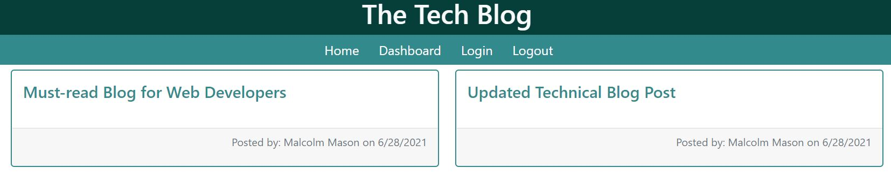
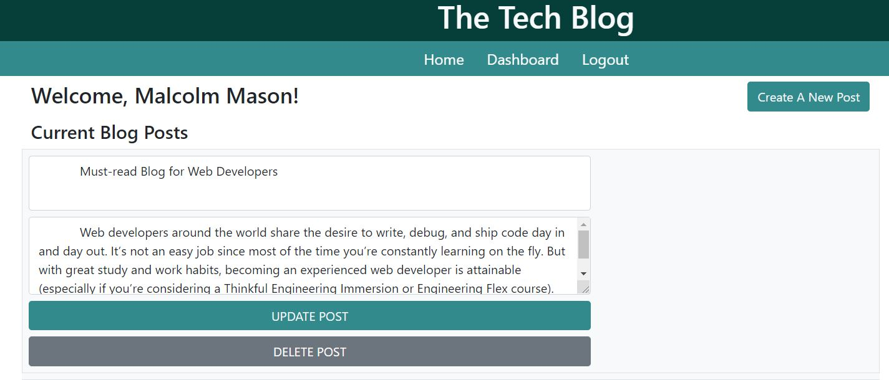
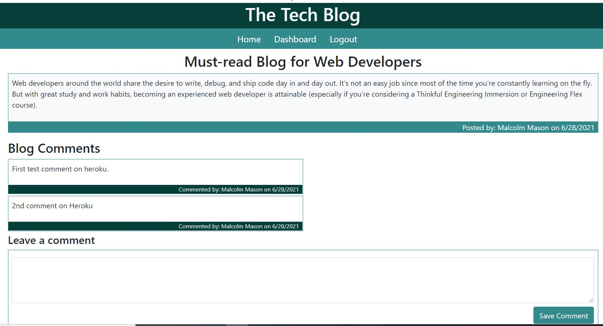

# The Tech Blog


## 📝Description

```
The Tech Blog is a website for writing and posting technical articles.
Users are welcome to sign up for a free account so they can publish their 
own articles as well as commenting and giving opinions on articles written 
by other authors.

```

## 🧰 Technologies Used

* `Node.js`
* `npm (Node Package Manager)`
* `Javascript`
* `Sequelize`
* `MySQL2`
* `Express.js`
* `Express-Handlebars`
* `Bcrypt`

## 📄 Installation Instructions

No installation is required for this application. You can test and use the app by navigating to the Heroku Live Deployment shown in the application links below. 

## 📸 Application Screenshots

`HOMEPAGE`

`DASHBOARD`

`BLOG POST WITH COMMENTS`



## 🔗 Application Links
* [Github](https://github.com/malmason/tech-blog)
* [Heroku Live Deployment](https://tranquil-coast-29213.herokuapp.com/)

## 📱 Contact 

Malcolm Mason - [Github](https://github.com/malmason) Email: [Malcolm](mailto:malmason66@gmail.com) 📧

---

&copy; 2021 Malcolm Mason